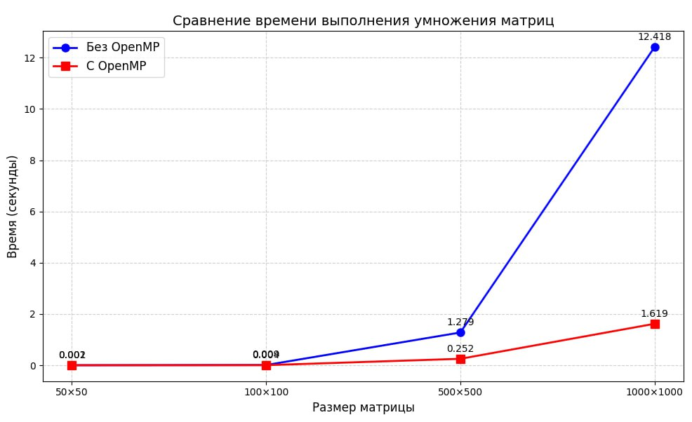

# Умножение матриц с помощью технологии OpenMP

## Описание
Данный проект представляет собой реализацию алгоритма умножения матриц по технологии OpenMP.
## Проверка
Проверка производится с использованием библиотеки numpy в файле verify.py

## Результаты
Записаны в файл result.txt и info.txt

| Размер      | Время выполнения (сек) без OpenMP | Время выполнения (сек) с OpenMP |
|-------------|-----------------------------------|---------------------------------|
| 50x50       | 0.0012598                         | 0.0015021                       |
| 100x100     | 0.0091451                         | 0.0041557                       |
| 500x500     | 1.27878                           | 0.251998                        |
| 1000x1000   | 12.4177                           | 1.61884                         |

